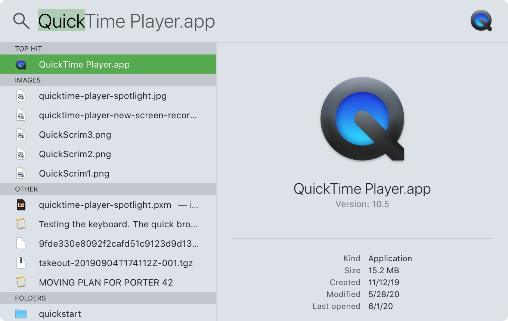
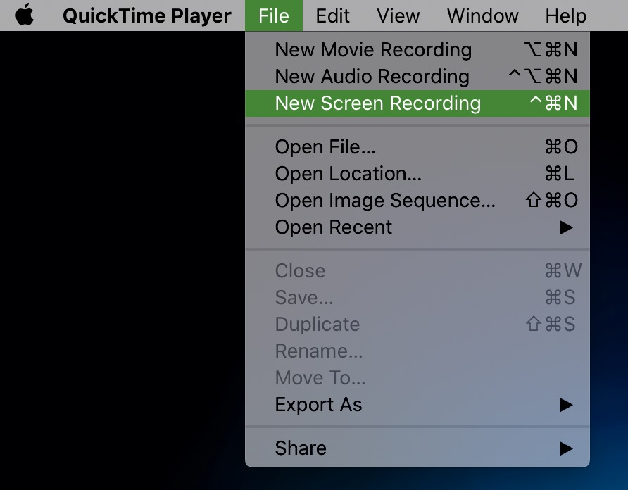

# Capstone Recording Setup

This document will serve as a guide on how to best record and present a capstone project, so that being remote will not be a barrier to creating a high-quality capstone project to be seen by employer partners et al.

* [Screen Recording](#screen-recording)
* [Camera (Presenter) Recording](#camera-presenter-recording)

## Screen Recording

During your presentation, you will be using QuickTime Player to record your screen. You can find QuickTime by activating Spotlight (⌘ - space) and typing in **QuickTime Player**, then either double clicking the icon or pressing 'Enter'.

 Once you open QuickTime, you'll be able to start a new screen recording, by going to the top menu bar and selecting **File -> New Screen Recording**.

Once the next menu pops up, you'll want to be sure to set your microphone, screen you're recording (if multiple monitors attached to your Mac), and a few extra presentation options.

## Camera (Presenter) Recording

When recording your presentation, you should use your iPhone (or Android phone) mounted to a tripod (if possible), unless you already have a webcam capable of recording at 1080p. The webcams on all Macs are relatively terrible, so you will achieve wildly better quality by using the camera on your phone.

* iPhone at 1080p60 or 4k60 [Apple Support Article with Explanation](https://support.apple.com/en-us/HT209431)
* Android at highest quality [Support Article showing how to max out Android camera quality](https://www.dummies.com/consumer-electronics/tablets/android-tablets/how-to-change-the-resolution-on-your-android-tablets-camera/)

## Lighting

To ensure the best video for your presentation, make sure that your face is evenly lighted in the frame of the video. If you have a window lighting up the left side of your face, but not the right, your lighting will become distracting to the viewer. If you have to put a desk lamp on the floor in front of you to even out the lighting (or on a table in front of you) - go for it! Good lighting makes a decent video into a fantastic one.

## Sound (Microphone)

When recording your narration video, you'll be using the built-in microphone of your cell phone / camera. It's important to note that **AirPods microphone quality is very bad**. The microphone in AirPods is only capable of recording 16-bit at 8kHz, while the built-in Mic on your Mac can likely record up to 32-bit at 96kHz.

**DO NOT USE AIRPODS FOR RECORDING AUDIO DURING YOUR SCREENCASTS**

Even if you're going to be using AirPods for monitoring audio, be sure to **change the microphone to your Mac built-in mic** when recording your screencast with QuickTime.

### Panel Review expectations:

* Enter each panel review with the exact background, laptop placement, standing/sitting position, etc. you plan to use during the actual presentation.
* Approach the panel review as prepared as possible for that specific round so our feedback is valuable and effective.

### Presentation expectations:

* **Dress attire** - Wear the complete professional ensemble you would have worn for the in-person DD. If you’d like, you may wear the exact outfit you wore for your professional headshots. There is no need to purchase a $200+ outfit for this!
* **NO greenscreens!** Choose a soft, solid color as your background; think of a wall in your house as a backdrop.
* **Remove potential background distractions** - try to avoid messy rooms, beds, ceiling fans, animals, etc.
* **Turn off all phone/laptop notifications.** We don’t want any interruptions bc of pings, rings, and vibration sounds.
* **Clean your camera lens** - run a microfiber cloth over the camera you will be using to record.
* **Stand up while presenting, if possible.** If standing up, please make sure the camera is eye level, if not a bit above eye level. DO NOT stand up if the camera will be angled up at your face, highlighting your chin. Sit down and elevate the camera as necessary to be eye level.
